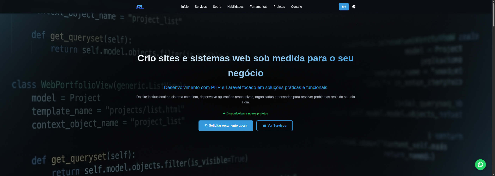

# Robson Luiz - Portfolio

  

## 🌟 About

Professional portfolio developed to showcase my projects and skills as a Front-end Web Developer, focusing on creating interactive and responsive experiences.

## 🚀 Features

- **Responsive Design** - Adapts to different screen sizes
- **Light/Dark Mode** - Smooth theme switching
- **Multi-language** - Support for Portuguese and English
- **Featured Projects**:
  - FM System - Personal financial management system (under development)
  - Personal Blog - Blog developed in 2017, refactored in 2025.
  - Celke Website - New version of the Celke website and platform, developed in 2025.
  - SimplePage - Website with administrative system, developed in 2017, refactored in 2025.

## 🛠️ Technologies Used

- **Frontend**:
  - HTML5
  - CSS3 (Vanilla)
  - JavaScript (Vanilla)
  - Font Awesome (icons)

- **Tools**:
  - Git for version control
  - GitHub Pages for hosting

## 🌐 Live Demo

- **English**: [https://robson-luiz.github.io/portfolio/en.html](https://robson-luiz.github.io/portfolio/en.html)
- **Português**: [https://robson-luiz.github.io/portfolio/](https://robson-luiz.github.io/portfolio/)

## 📞 Contact

- **Email**: robsonluiz_6@hotmail.com
- **WhatsApp**: +55 11 91329-5246
- **LinkedIn**: [robsonluiz](https://www.linkedin.com/in/robsonluiz/)
- **GitHub**: [robson-luiz](https://github.com/robson-luiz)

---

Developed by [Robson Luiz](https://github.com/robson-luiz)