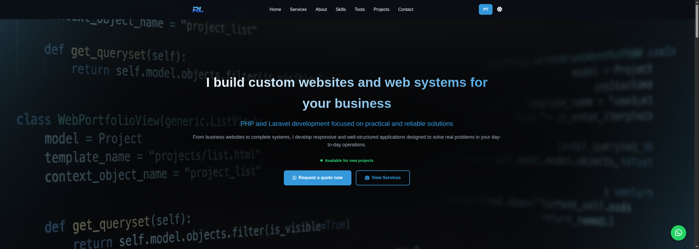

# Robson Luiz - Portfolio

  

## 🌟 About

Professional portfolio developed to showcase my projects and skills as a Freelance Web Developer, focused on building custom websites, web systems, and landing pages for businesses.

## 🚀 Features

- **Responsive Design** - Adapts to different screen sizes
- **Light/Dark Mode** - Smooth theme switching
- **Multi-language** - Support for Portuguese and English
- **Services Offered**:
  - Professional Websites - Fast, responsive websites optimized for SEO
  - Web Systems - Custom systems to automate and organize businesses
  - Landing Pages - Conversion-focused pages
  - Maintenance & Support - Ongoing updates and improvements
- **Featured Projects**:
  - FM System - Personal financial management system with Laravel 12, Tailwind CSS and MySQL
  - Personal Blog - Blog in PHP with admin panel, developed in 2017 and refactored in 2025
  - Celke Website - New version of the Celke website and platform, built with Laravel 12 and Tailwind CSS
  - SimplePage - Website with administrative system in PHP and Bootstrap, developed in 2017 and refactored in 2025

## 🛠️ Technologies Used

- **Frontend**:
  - HTML5
  - CSS3 (Vanilla)
  - JavaScript (Vanilla)
  - Font Awesome (icons)

- **Tools**:
  - VS Code (with GitHub Copilot)
  - ChatGPT / Grok / Gemini (AI assistants)
  - Git for version control
  - GitHub Pages for hosting

## 🌐 Live Demo

- **English**: [https://robsonlsantos.com/en.html](https://robsonlsantos.com/en.html)
- **Português**: [https://robsonlsantos.com/](https://robsonlsantos.com/)

## 📞 Contact

- **Email**: robsonluiz_6@hotmail.com
- **WhatsApp**: +55 11 91329-5246
- **LinkedIn**: [robsonluiz](https://www.linkedin.com/in/robsonluiz/)
- **GitHub**: [robson-luiz](https://github.com/robson-luiz)
- **X (Twitter)**: [@robsonl_santos](https://x.com/robsonl_santos)

---

Developed by [Robson Luiz](https://github.com/robson-luiz)
