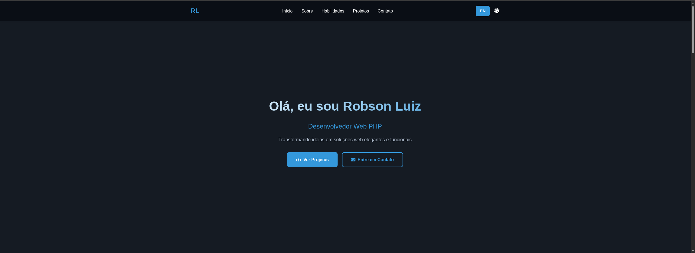

# Robson Luiz - Portfolio

  

## 🌟 Sobre

Portfólio profissional desenvolvido para apresentar meus projetos e habilidades como Desenvolvedor Web Front-end, com foco em criar experiências interativas e responsivas.

## 🚀 Recursos

- **Design Responsivo** - Layout que se adapta a diferentes tamanhos de tela
- **Modo Claro/Escuro** - Alternância suave entre temas
- **Idiomas** - Suporte a Português e Inglês
- **Projetos em Destaque**:
  - FM System - Sistema de gerenciamento financeiro pessoal (em desenvolvimento)
  - Blog Pessoal - Blog desenvolvido em 2017, refatorado em 2025.
  - Site Celke - nova versão do site e da plataforma da Celke, desenvolvido em 2025.
  - SimplePage - Site com sistema administrativo, desenvolvido em 2017, refatorado em 2025.

## 🛠️ Tecnologias Utilizadas

- **Frontend**:
  - HTML5
  - CSS3 (Vanilla)
  - JavaScript (Vanilla)
  - Font Awesome (ícones)

- **Ferramentas**:
  - Git para controle de versão
  - GitHub Pages para hospedagem

## 🌐 Acesso

- **Português**: [https://robsonlsantos.com/](https://robsonlsantos.com/)
- **English**: [https://robsonlsantos.com/en.html](https://robsonlsantos.com/en.html)

## 📞 Contato

- **E-mail**: robsonluiz_6@hotmail.com
- **WhatsApp**: +55 11 91329-5246
- **LinkedIn**: [robsonluiz](https://www.linkedin.com/in/robsonluiz/)
- **GitHub**: [robson-luiz](https://github.com/robson-luiz)

---

Desenvolvido por [Robson Luiz](https://github.com/robson-luiz)